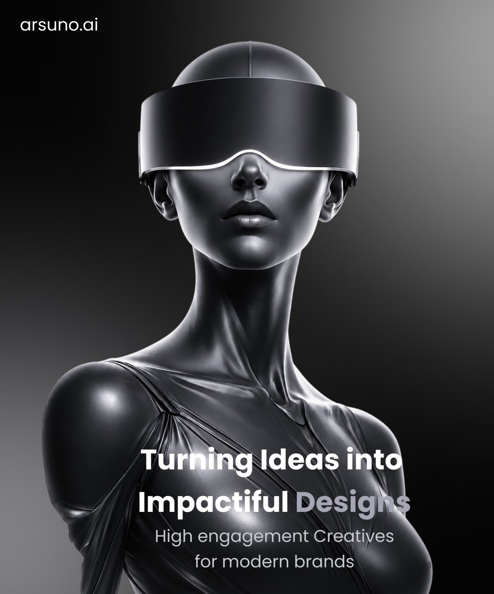

UI DESIGN / 14

<h1 align="center">BOLD DESIGN</h1>

A high-impact monochrome composition exploring scale, contrast, and type.

VISUAL DESIGN · POSTER · FIGMA

A dramatic poster-style composition using a monochrome figure, strong crop, and oversized message placement.

<a href="https://www.figma.com/design/xCEuwEmHg65B8XHz1ide35/Portfolio-designs"><strong>VIEW IN FIGMA →</strong></a>

<a href="../../">← BACK TO PORTFOLIO</a>

