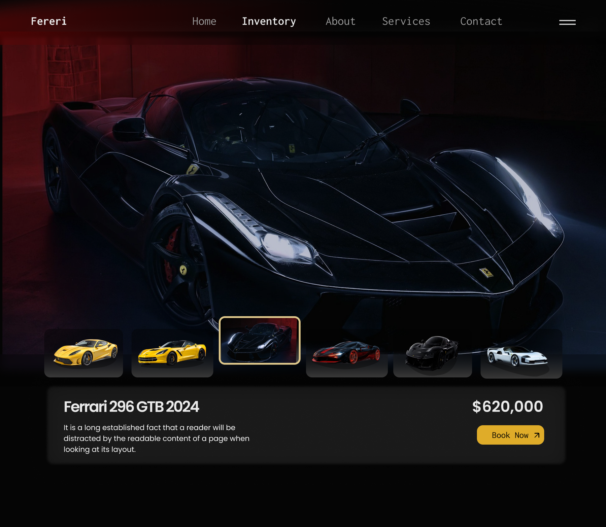

UI DESIGN / 12

<h1 align="center">CAR STORE HERO PAGE</h1>

A cinematic luxury car inventory hero with high-contrast product focus.

AUTOMOTIVE UI · DESKTOP · FIGMA

A dark automotive interface built around a dramatic vehicle image, inventory thumbnails, and a clear booking action.

<a href="https://www.figma.com/design/xCEuwEmHg65B8XHz1ide35/Portfolio-designs"><strong>VIEW IN FIGMA →</strong></a>

<a href="../../">← BACK TO PORTFOLIO</a>

