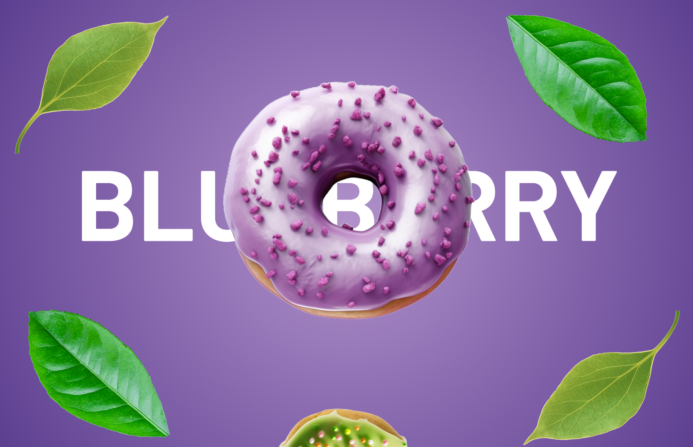
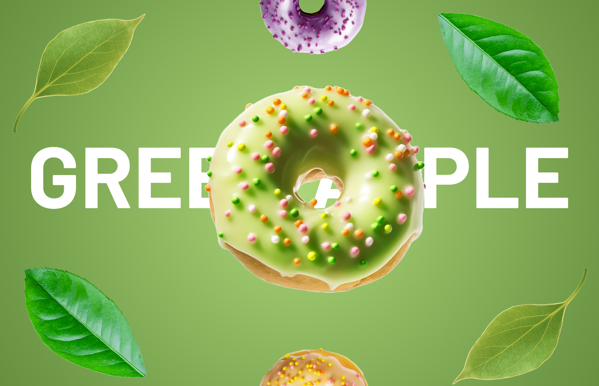
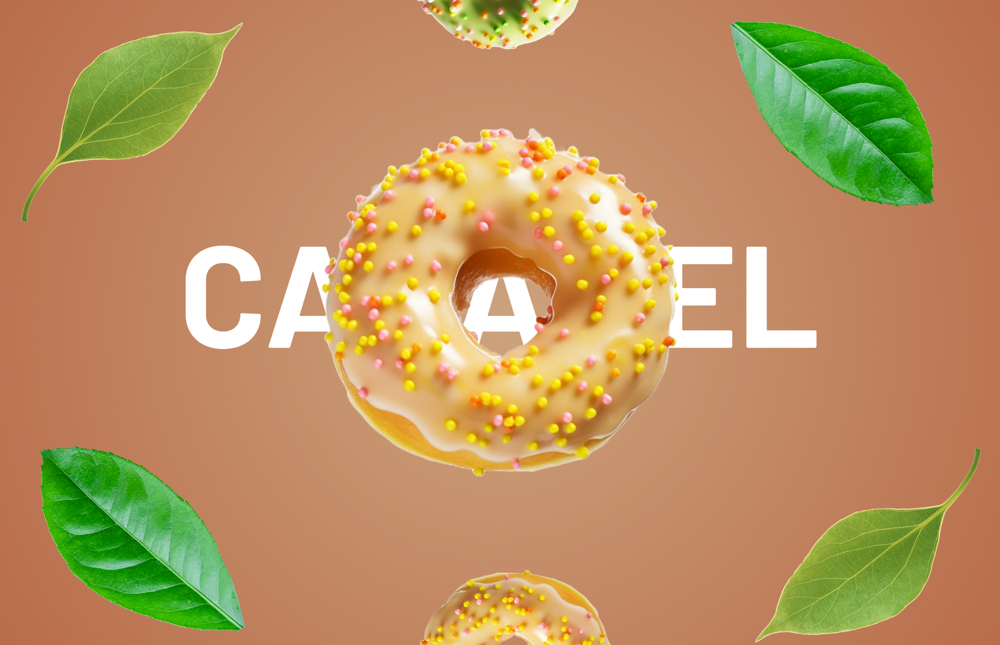

UI DESIGN / 05

<h1 align="center">DONUT STORE</h1>

A playful flavor-led concept with oversized product imagery and color.

BRAND UI · DESKTOP · FIGMA

<table align="center"><tr><td align="center" width="33%"></td><td align="center" width="33%"></td><td align="center" width="33%"></td></tr></table>

A bold visual system built around three donut flavors, large typography, and vivid product-led composition.

<a href="https://www.figma.com/design/xCEuwEmHg65B8XHz1ide35/Portfolio-designs"><strong>VIEW IN FIGMA →</strong></a>

<a href="../../">← BACK TO PORTFOLIO</a>

