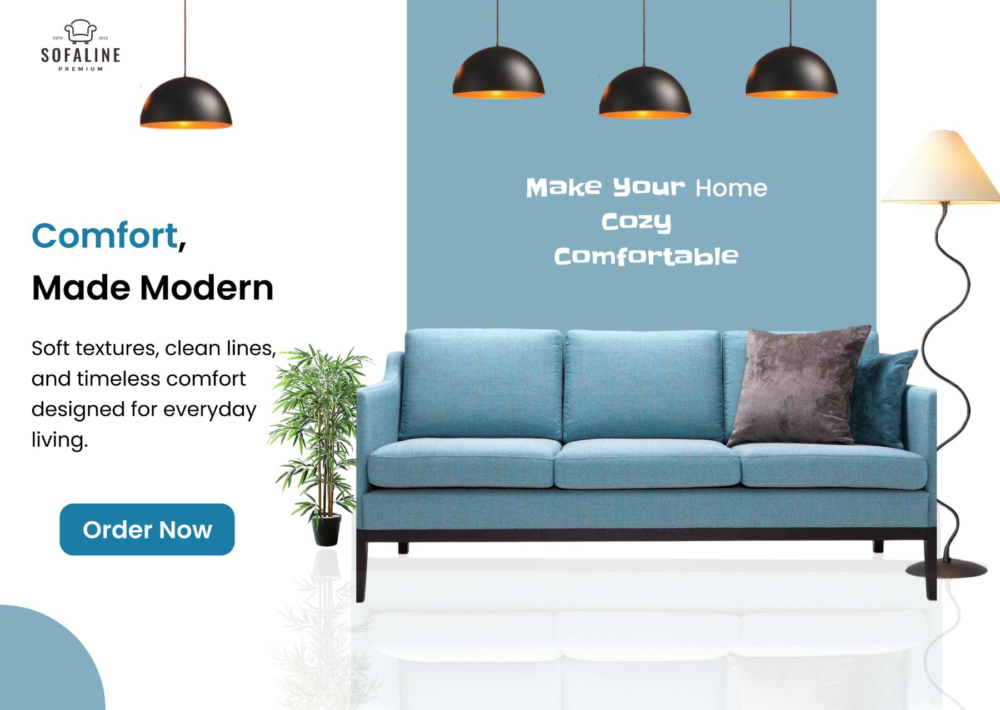

UI DESIGN / 08

<h1 align="center">FURNITURE STORE HERO PAGE</h1>

A modern furniture hero pairing clean typography with product-focused imagery.

PRODUCT UI · DESKTOP · FIGMA

A compact furniture landing concept that uses a strong product silhouette, soft blue accents, and clear conversion messaging.

<a href="https://www.figma.com/design/xCEuwEmHg65B8XHz1ide35/Portfolio-designs"><strong>VIEW IN FIGMA →</strong></a>

<a href="../../">← BACK TO PORTFOLIO</a>

