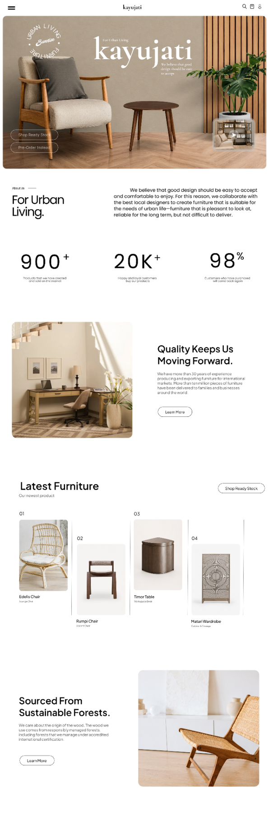

UI DESIGN / 07

<h1 align="center">FURNITURE STORE</h1>

A warm editorial storefront balancing product discovery and brand story.

E-COMMERCE · DESKTOP · FIGMA

A full furniture storefront combining editorial storytelling, product discovery, and a calm material-led visual language.

<a href="https://www.figma.com/design/xCEuwEmHg65B8XHz1ide35/Portfolio-designs"><strong>VIEW IN FIGMA →</strong></a>

<a href="../../">← BACK TO PORTFOLIO</a>

