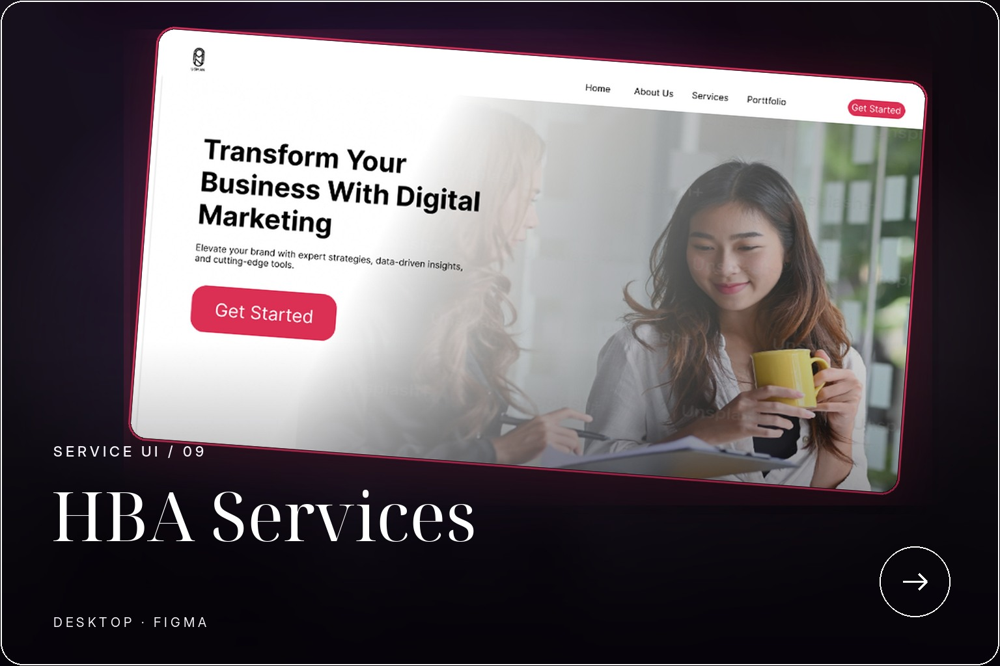
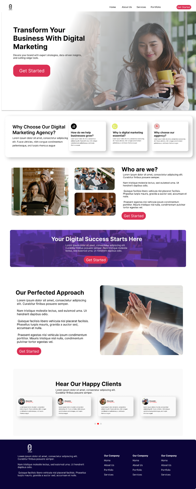

UI DESIGN / 09

<h1 align="center">HBA SERVICES</h1>

A service-led agency website designed around clarity, trust, and conversion.

SERVICE UI · DESKTOP · FIGMA

 

  

A structured marketing-services page with clear calls to action, social proof, and modular content sections.

  <strong>FIGMA LINK PENDING</strong>

  <a href="../../README.md">← BACK TO PORTFOLIO</a>

