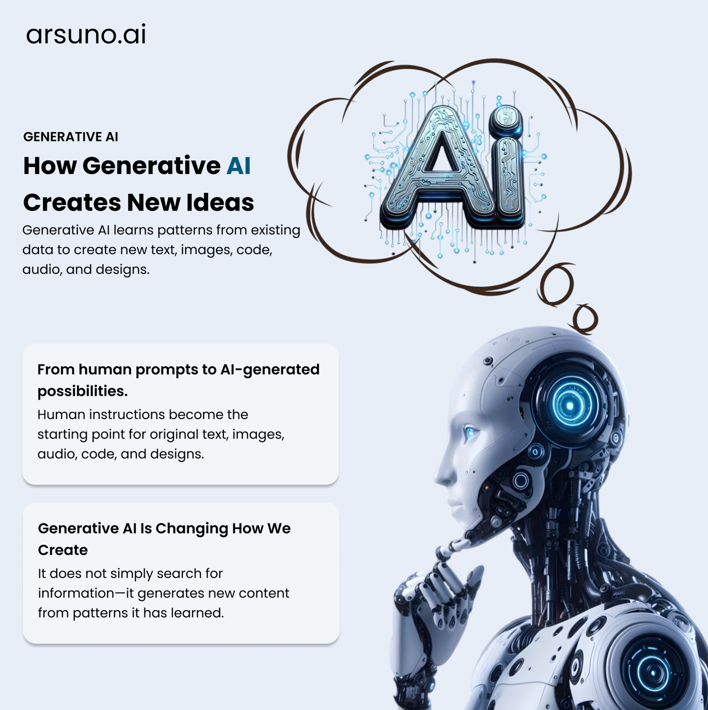

UI DESIGN / 15

<h1 align="center">HOW AI GENERATES NEW IDEAS</h1>

An educational visual showing how generative AI turns prompts into new content.

INFOGRAPHIC · AI · FIGMA

 

  

A compact explainer designed to communicate generative AI concepts through clear hierarchy, illustration, and supporting cards.

  <strong>FIGMA LINK PENDING</strong>

  <a href="../../README.md">← BACK TO PORTFOLIO</a>

