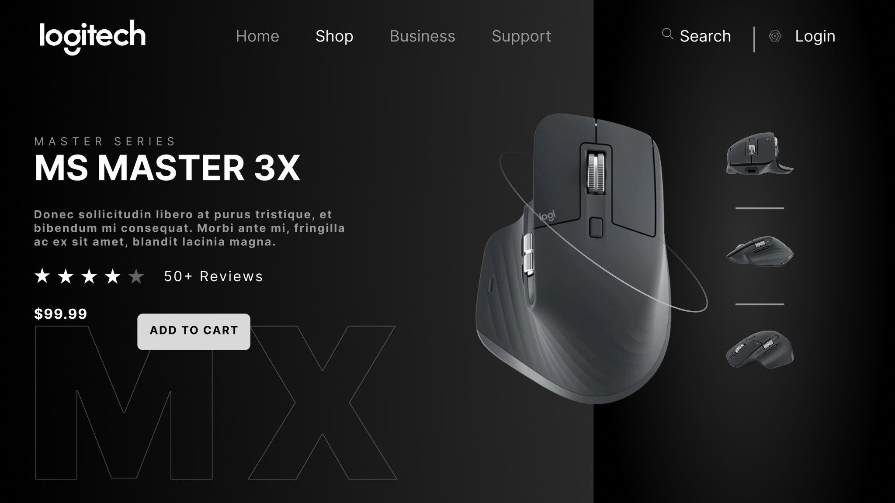

UI DESIGN / 01

<h1 align="center">LOGITECH HERO PAGE</h1>

A study in contrast, form and product focus.

PRODUCT UI · DESKTOP · FIGMA

  

A desktop product concept pairing bold imagery with a restrained dark palette. Clear hierarchy brings the product and purchase action into focus.

<a href="https://www.figma.com/design/xCEuwEmHg65B8XHz1ide35/Portfolio-designs?node-id=4-79"><strong>VIEW IN FIGMA →</strong></a>

<a href="../../">← BACK TO PORTFOLIO</a>

