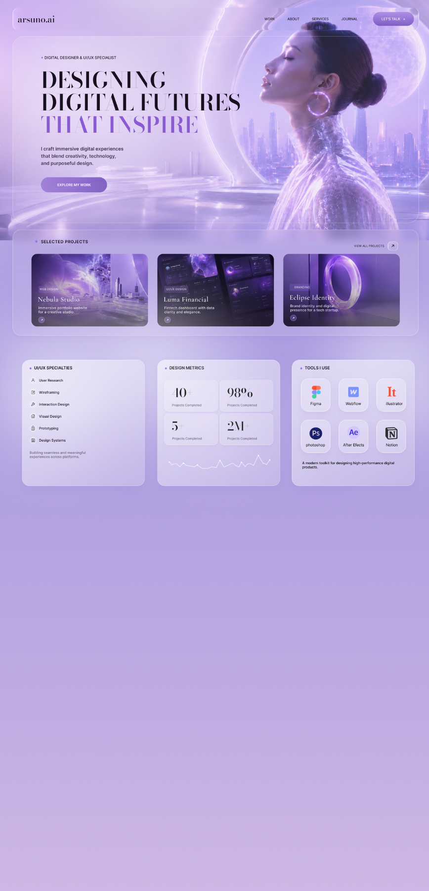

UI DESIGN / 11

<h1 align="center">MODERN PORTFOLIO</h1>

A futuristic personal portfolio with soft glass surfaces and editorial type.

PORTFOLIO UI · DESKTOP · FIGMA

A lavender portfolio direction combining translucent surfaces, cinematic imagery, and compact project presentation.

<a href="https://www.figma.com/design/xCEuwEmHg65B8XHz1ide35/Portfolio-designs"><strong>VIEW IN FIGMA →</strong></a>

<a href="../../">← BACK TO PORTFOLIO</a>

