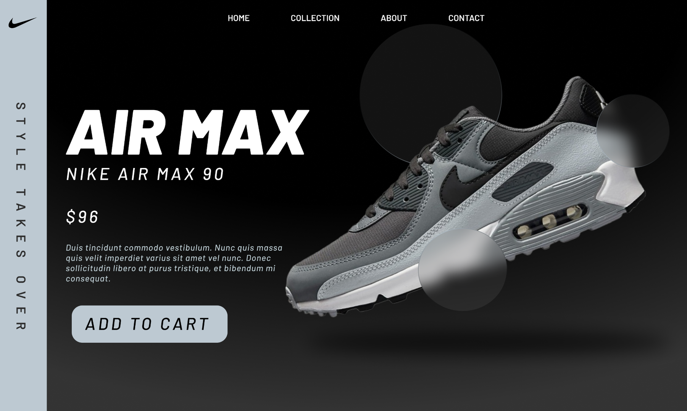

UI DESIGN / 02

<h1 align="center">NIKE AIR MAX</h1>

A monochrome sneaker hero focused on bold product storytelling.

PRODUCT UI · DESKTOP · FIGMA

A high-contrast product landing concept that keeps the shoe dominant while maintaining a simple shopping path.

<a href="https://www.figma.com/design/xCEuwEmHg65B8XHz1ide35/Portfolio-designs"><strong>VIEW IN FIGMA →</strong></a>

<a href="../../">← BACK TO PORTFOLIO</a>

