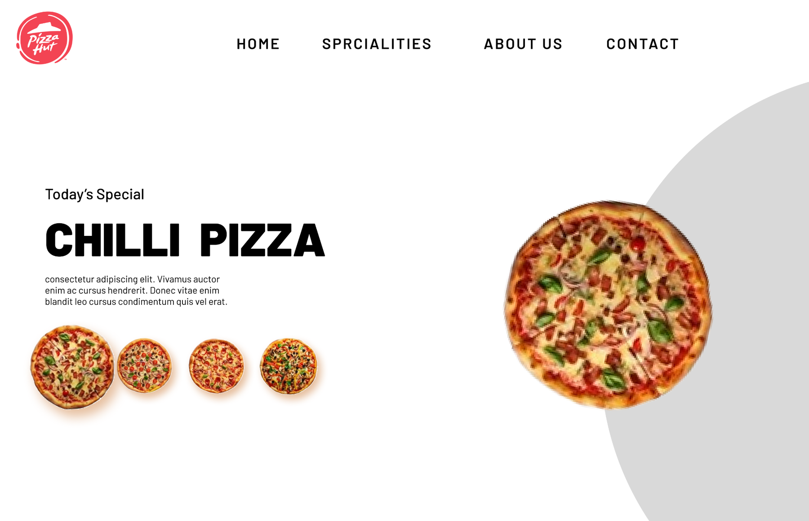
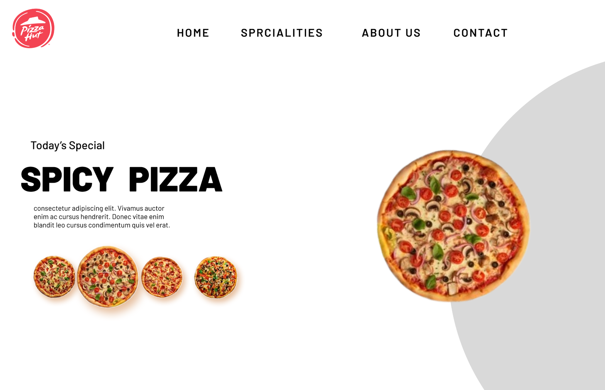
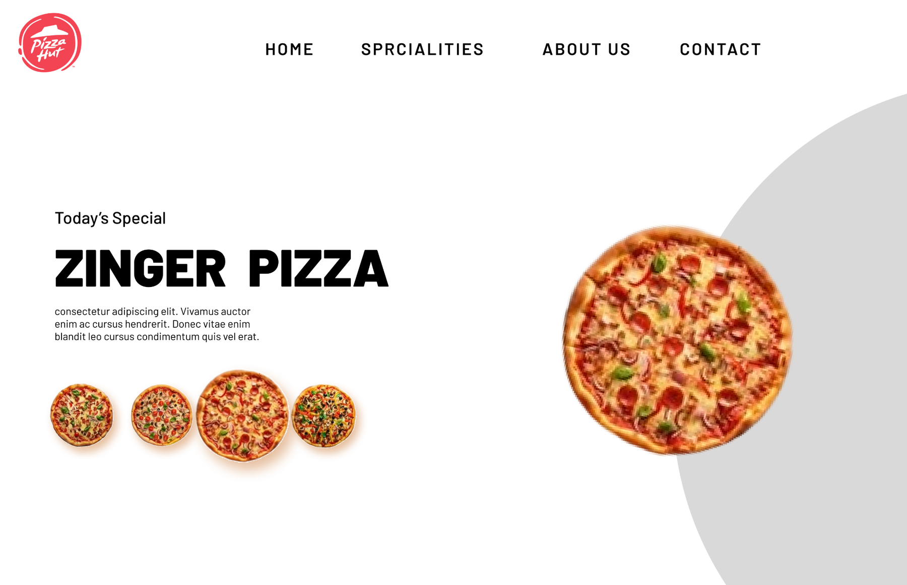
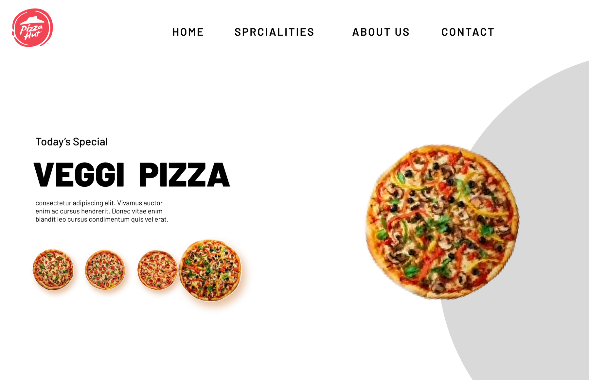

UI DESIGN / 04

<h1 align="center">PIZZA STORE</h1>

A clean food landing concept built around rotating daily specials.

E-COMMERCE · DESKTOP · FIGMA

<table align="center"><tr><td align="center" width="50%"></td><td align="center" width="50%"></td></tr><tr><td align="center" width="50%"></td><td align="center" width="50%"></td></tr></table>

A simple multi-state restaurant concept where one layout adapts across four featured pizza selections.

<a href="https://www.figma.com/design/xCEuwEmHg65B8XHz1ide35/Portfolio-designs"><strong>VIEW IN FIGMA →</strong></a>

<a href="../../">← BACK TO PORTFOLIO</a>

