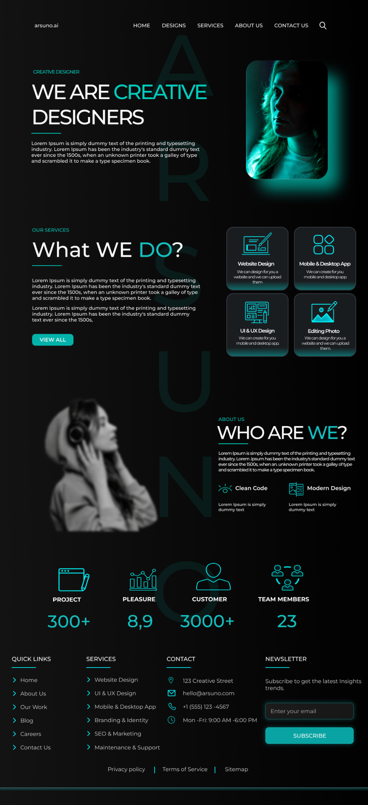

UI DESIGN / 10

<h1 align="center">PORTFOLIO DESIGN</h1>

A dark creative portfolio concept with neon accents and service modules.

PORTFOLIO UI · DESKTOP · FIGMA

 

  

A long-form creative portfolio balancing a black canvas, cyan highlights, service cards, and personal-brand storytelling.

  <strong>FIGMA LINK PENDING</strong>

  <a href="../../README.md">← BACK TO PORTFOLIO</a>

