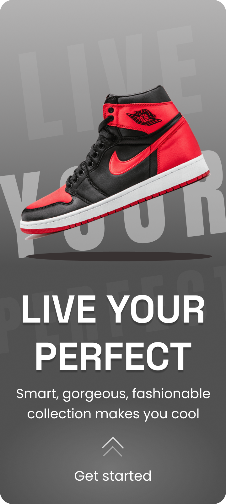
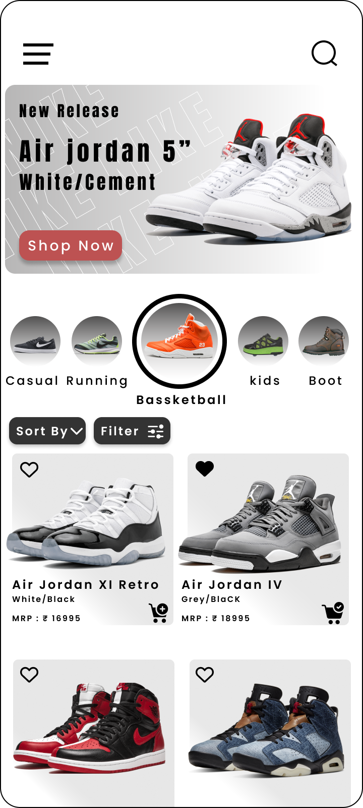
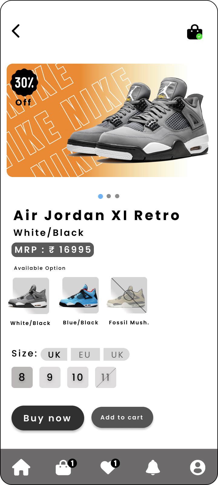

UI DESIGN / 03

<h1 align="center">SHOE STORE</h1>

A mobile sneaker shopping flow from discovery to product selection.

E-COMMERCE · MOBILE · FIGMA

<table align="center"><tr><td align="center" width="33%"></td><td align="center" width="33%"></td><td align="center" width="33%"></td></tr></table>

A three-screen commerce flow covering entry, browsing, and product detail with a strong footwear-first visual hierarchy.

<a href="https://www.figma.com/design/xCEuwEmHg65B8XHz1ide35/Portfolio-designs"><strong>VIEW IN FIGMA →</strong></a>

<a href="../../">← BACK TO PORTFOLIO</a>

