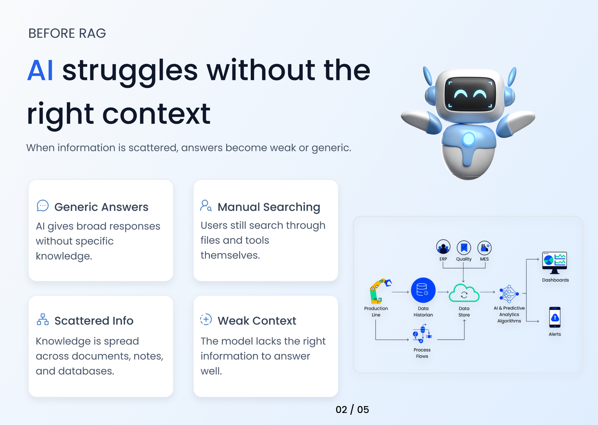

UI DESIGN / 16

<h1 align="center">WORLD BEFORE RAG</h1>

An explanatory visual showing why AI struggles without the right context.

INFOGRAPHIC · AI · FIGMA

A visual explainer that frames the information-access problem before retrieval-augmented generation is introduced.

<a href="https://www.figma.com/design/xCEuwEmHg65B8XHz1ide35/Portfolio-designs"><strong>VIEW IN FIGMA →</strong></a>

<a href="../../">← BACK TO PORTFOLIO</a>

