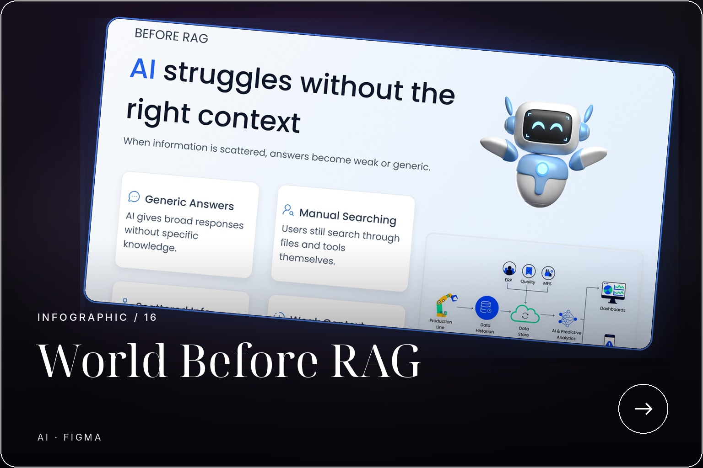

UI DESIGN / 16

<h1 align="center">WORLD BEFORE RAG</h1>

An explanatory visual showing why AI struggles without the right context.

INFOGRAPHIC · AI · FIGMA

 

  

A visual explainer that frames the information-access problem before retrieval-augmented generation is introduced.

  <strong>FIGMA LINK PENDING</strong>

  <a href="../../README.md">← BACK TO PORTFOLIO</a>

